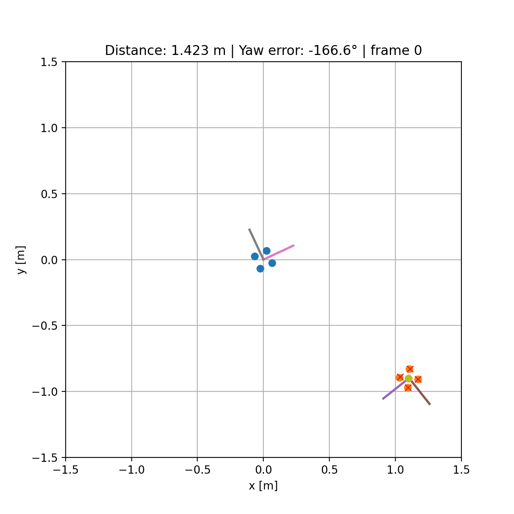

# PG-Navigator

Real-time pose guidance and alignment tools for OptiTrack — probe, park and snap target poses for HD-sEMG grid workflows.

## Quick start

1. Create a Python environment and install deps:
   - pip:
     ```
     pip install -r requirements.txt
     ```
   - or conda:
     ```
     conda create -n pgnav python=3.10
     conda activate pgnav
     pip install -r requirements.txt
     ```

2. Launch the GUI:
   ```
   python src/ui.py
   ```
   Click "Start" in the UI to begin tracking. Use "Save Target" and "Report Δpos" to snapshot/inspect the current pose.

## What it does

- Connects to a NatNet server (OptiTrack) and computes subject↔grid relative transforms.
- Live display of translation error (mm), rotation error (°) and an alignment score.
- Save target poses, take per-snapshot JSON files and a run-scoped snapshot CSV.
- Visual arrow preview showing the delta vector to the saved target.

### Simulation of NatNet data




## Configuration

- NatNet server / local IP and rigid-body names are configured at the top of `src/tracker.py`.
- Tolerances (TRANS_TOL_MM, ROT_TOL_DEG) and logging intervals are configurable in the same file.

## Dependencies

- numpy
- PyQt5
- pyqtgraph
- natnet

(see `requirements.txt` for exact pins)

## Development notes

- The tracker logic is callable from the UI (no fragile stdout parsing). The UI starts the tracker in a background thread and receives updates via callbacks.
- UI hotkeys / extra controls can be wired to the `tracker.Control` API (request_save / request_report).
- Avoid import-time side effects in `tracker.py` if packaging as a Python package — use the provided run-path helper when starting runs.

## License

GPL-3.0 License